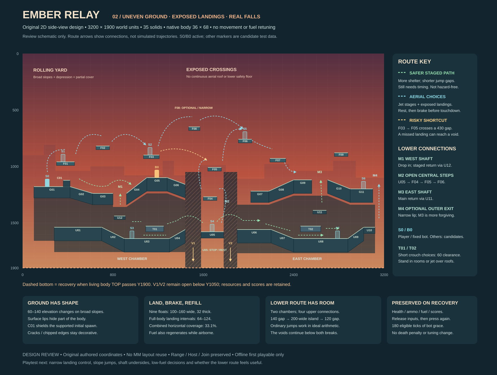

# Ember Relay — original map implementation brief

**Working title; design proposal v2, 2026-09-13.** This revision replaces Ember Relay v1’s flat slabs and long decks with uneven terrain, short floating landings and a substantial broken lower route. It remains one original, compact offline map. It specifies future implementation; no gameplay, assets for the runtime, dependencies or builds were changed in this design task.

[Open the original SVG layout diagram](design/ember-relay-layout.svg). The diagram is an overview of the **2D side-view playfield**, with X horizontal and Y elevation increasing downward. It is a layout schematic, not an overhead 3D map or gameplay screenshot. Solid IDs and coordinates correspond exactly to the tables below; route arrows communicate connections, not simulated trajectories. The SVG remains editable vector code with no embedded raster image or external resource.

Read with [AGENTS.md](../AGENTS.md), [context](PROJECT_CONTEXT.md), [roadmap](ROADMAP.md), [inventory](WEB_TO_NATIVE_INVENTORY.md), [handoff 12](handoffs/12-web-to-native-inventory.md), [gameplay reference](REFERENCE_GAMEPLAY.md) and [approved visual direction](VISUAL_DIRECTION.md). Native source inspected at `7e9610a3d2398e058bfee74bf7fd684b8f0d13fe`; web reference remains read-only at `7a398d4abefa8144fa8949998de4cd76e5dacf8a`. Prior uncommitted documentation is preserved.

## 1. Direction and review status

**User direction:** retain the overall original evening concept, but make terrain less flat/orderly/safe: meaningful elevation and partial cover; small staggered platforms with exposed flight; a substantial underground alternative; visible gaps that can actually lead to a fall. Intentional irregularity should create choices and recoverable funny mistakes, not random roughness everywhere. No MM layout copying, tracing, coordinate transformation or recognizable topology reuse. GTA/Apex remain broad atmosphere references only.

**Existing approvals preserved:** native movement/jump/jet/fuel and standing body; range/combat/visual baseline; menu and Host/Join; offline-only first map; falls retain resources/scores, require released controls and give 180 eligible ticks of bot grace. No death penalty or new weapons, audio, backend or additional maps. Implementation is not authorized by this design task.

**Resolved design recommendations:** keep 3200×1900 bounds and working title; replace 17 solids with **35 (26 rectangles, nine convex quads)**; use nine small aerial platforms and a 200-wide lower resting island; keep S0 as the deterministic player/recovery spawn and place the fixed bot on the western brow. The new geometry, crouch details and route feel await user design review and later native playtesting; they are not already approved gameplay. No material unanswered preference blocks this revision.

| V1 issue / user feedback | V2 choice and purpose | Approval impact |
| --- | --- | --- |
| Long flat ground; predictable cover | Broad 60–140-unit surface elevation changes, a depression and supported slopes; 56-high cover near the spawn. | Map design revision requested; standing tuning unchanged. |
| Long decks protect too much airspace | Nine 100–160-wide floating platforms, asymmetric heights and exposed crossings. | New geometry to review; no jet/fuel change. |
| Lower conduit feels shallow and inevitable | Two roomy lower chambers, short low shortcuts, four combat connections and two staged breaks. | New route design; crouch remains proposed, offline only. |
| Most missed landings reach a floor | Two full-height lower void corridors; fast fuel shortcuts over them, shorter ordinary-jump route below. | Approved recovery unchanged; increased map risk is intentional feedback. |
| Orderly silhouettes | Long supported slopes and offset landings define collision; cracks/chipped outlines are cosmetic. | Existing simple visual direction retained. |

The [Outpost brief](OUTPOST_IMPLEMENTATION_BRIEF.md) remains historical algorithm/source analysis, not a geometry or asset-import instruction. V2 supersedes all v1 solid counts, coordinates and route estimates; previous approvals and unrelated inventory evidence remain intact.

## 2. Exact original geometry and topology

**Ember Relay** is an interrupted transfer facility at dusk: a rolling loading yard above two service chambers, a broken central span and scattered relay platforms. The schematic is a side view. X increases right; Y increases down; all positions are native world units with top-left actor/rectangle coordinates. The 36×68 standing actor is not rescaled.

| Area | Function and connections | Tradeoff |
| --- | --- | --- |
| Rolling surface | G01–G06 west, G07–G11 east. Depression, brow and crest create partial cover. M1/M3 openings connect below. | Clear spawn bench; slope lips interrupt low shots, while jump/jet exposes the pilot. The middle surface does not bridge the rift. |
| Floating route | F01–F09; west ascent, optional crown, exposed central steps, east exits. | Several ascent/crossing choices, short landings and open sightlines. Fast crossings need fuel and active braking. |
| Lower service route | U01–U10, with U11/U12 entry steps. Two chambers connected across U05. T01/T02 are brief low shortcuts. | Longer, more sheltered approach with resting room, but two real jump gaps. Fuel is needed for upward exits, not the two lower crossing hops. |

World **W=3200, H=1900**. All 35 solids below collide on every face, including platform undersides. No one-way/moving/destructible geometry, concave importer or physical decorative supports.

### Rectangles: `(x, y, width, height)`

| ID | Solid | X | Y | Width | Height |
| --- | --- | ---: | ---: | ---: | ---: |
| G01 | Spawn bench | 100 | 1180 | 320 | 100 |
| G03 | Yard depression | 620 | 1240 | 180 | 100 |
| G05 | Bot brow | 1100 | 1100 | 180 | 120 |
| G07 | East broken lip | 2020 | 1220 | 160 | 100 |
| G09 | East crest | 2400 | 1120 | 160 | 120 |
| G11 | East refuge | 2900 | 1200 | 200 | 120 |
| U01 | West chamber bed | 280 | 1540 | 420 | 120 |
| U03 | West deep chamber | 900 | 1640 | 400 | 120 |
| U05 | Rift rest island | 1580 | 1580 | 200 | 56 |
| U06 | East landing bed | 1900 | 1560 | 300 | 120 |
| U08 | East deep chamber | 2400 | 1640 | 480 | 120 |
| U10 | Outer exit shelf | 3020 | 1540 | 100 | 56 |
| U11 | East shaft step | 2570 | 1390 | 120 | 32 |
| U12 | West shaft step | 810 | 1440 | 100 | 32 |
| F01 | Yard float | 300 | 960 | 160 | 32 |
| F02 | Offset float | 650 | 820 | 120 | 32 |
| F03 | Brow float | 1070 | 900 | 140 | 32 |
| F04 | Rift low perch | 1600 | 1270 | 120 | 32 |
| F05 | Rift mid perch | 1640 | 1010 | 120 | 32 |
| F06 | East high perch | 1910 | 760 | 120 | 32 |
| F07 | East offset float | 2190 | 930 | 140 | 32 |
| F08 | Optional crown | 1470 | 650 | 100 | 32 |
| F09 | East lookout | 2760 | 880 | 120 | 32 |
| T01 | West crouch shortcut | 1090 | 1530 | 160 | 50 |
| T02 | East crouch shortcut | 2460 | 1530 | 180 | 50 |
| C01 | Spawn partial cover | 360 | 1124 | 60 | 56 |

### Convex quads, boundary-order vertices

| ID | Solid | Vertices |
| --- | --- | --- |
| G02 | Yard descent | `(420,1180)`, `(620,1240)`, `(620,1340)`, `(420,1280)` |
| G04 | Brow ascent | `(920,1240)`, `(1100,1100)`, `(1100,1220)`, `(920,1340)` |
| G06 | Broken lip descent | `(1280,1100)`, `(1440,1160)`, `(1440,1280)`, `(1280,1220)` |
| G08 | East crest ascent | `(2180,1220)`, `(2400,1120)`, `(2400,1240)`, `(2180,1320)` |
| G10 | East refuge descent | `(2700,1120)`, `(2900,1200)`, `(2900,1320)`, `(2700,1240)` |
| U02 | West chamber descent | `(700,1540)`, `(900,1640)`, `(900,1760)`, `(700,1660)` |
| U04 | West rift approach | `(1300,1640)`, `(1440,1560)`, `(1440,1680)`, `(1300,1760)` |
| U07 | East chamber descent | `(2200,1560)`, `(2400,1640)`, `(2400,1760)`, `(2200,1680)` |
| U09 | Outer exit ascent | `(2880,1640)`, `(3020,1540)`, `(3020,1660)`, `(2880,1760)` |

Ground chains have shared end edges without cracks or interior overlap. G01→G02 drops 60; G04 rises 140 across 180; G06 drops 60. G08 rises 100, G10 drops 80. Lower slopes change height by 80–100. The steepest top is G04, slope 140/180≈0.778 (37.9°), upward normal Y≈−0.789; all are within the proposed walkable threshold −0.55. These are broad supported inclines, not small staircase teeth. C01 is the single deliberate jumpable 56-high, 60-wide spawn cover block.

### Openings, lower route and genuine fall space

- **M1 — west shaft, X800–920:** surface opening between G03/G04. U12 top 1440 is 200 below the surface lip 1240. From the adjacent lower floor near 1600, jet to U12, then surface; launch beside each solid and move over its top. A pilot standing on U12 has head 1372, below adjacent cap bottom 1340, leaving 32 of head clearance. Descending can step off U12 into the chamber. The western U01 alcove is a resting/turnaround branch, not an extra surface entrance.
- **M2 — central combat connection:** U05→F04→F05→F06 climbs 310/260/250 in separate fuel stages. U05 is 200 wide. Launch to F04 from body X≈1730, beside its right edge 1720; launch to F05 from X≈1600, left of its edge 1640. Rise before moving over solid undersides. This exposed route reconnects the lower path directly to aerial combat.
- **M3 — east shaft, X2560–2700:** U08→U11→surface climbs 250 then 270. First launch beside U11 (e.g. body X≈2720), clear top 1390, then steer left. U11-standing head 1322 clears adjacent surface cap bottom 1240 by 82. Descend off its right edge past T02’s end 2640 into open room. This is the main eastern return route.
- **M4 — optional outer exit:** U09→U10→G11, a 340-rise jet at the outside lip. Body X≈3100 is supported by 20 units of U10 and clears G11’s right edge 3100; the right body edge 3136 remains inside 3200. This deliberately narrower advanced exit is not required: M3 is the more forgiving choice.
- **Lower crossing:** U04 ends X1440 at Y1560; jump a **140 gap** to U05 at Y1580 (20 down). U05 ends 1780; jump a **120 gap** to U06 at Y1560 (20 up). U05 allows a complete stop/rest before the second hop. There is no continuous floor beneath either break.
- **V1:** X1440–1580, **V2:** X1780–1900 are entirely clear of solids from Y1050 down through recovery top Y1900. Full-body fall lanes are top-left X1440–1544 and 1780–1864 respectively. F08 is above this interval, not a hidden safety net. Neutral, jet-off bodies at (1490,1100) and (1810,1100) can fall to recovery without hitting any floor. Show both voids as visibly open, not black painted “pits” on a collider.

T01/T02 undersides are Y1580 over floor 1640: **60 clearance**, versus standing 68 and full crouch 54.20060507330696. Their low runs are only 160/180 long; full standing rooms generally have roughly 200–400 vertical airspace. Cross under for a sheltered short line; use a short jet over the roofs (tops 1530, rise 110) or enter/leave via the shafts and aerial route. Ordinary jump peak 85.83 cannot alone mount a 110-high roof. No required long crouch corridor or unavoidable dead end. The island and shaft exits remain exposed choke points to test.

Use invisible boundary rectangles `(-3200,-1900,3200,5700)`, `(3200,-1900,3200,5700)`, `(-3200,-1900,9600,1900)` for left/right/ceiling. **No global floor**. Bodies remain X0..3200 and top Y≥0; living-body recovery is strictly top Y>1900. The deepest walk surface/camera reference is `floor_y=1640`, not a floor at every X. Peripheral drop space also remains; S0 is well inside a supported bench, away from an unavoidable entry hazard.

### Standing spawn data

| ID | Role / surface | Top-left X | Top-left Y |
| --- | --- | ---: | ---: |
| S0 | Player / recovery / G01 | 200 | 1112 |
| S1 | Candidate / F01 | 340 | 892 |
| S2 | Candidate / F03 | 1110 | 832 |
| S3 | Candidate / U03 | 950 | 1572 |
| S4 | Candidate / U05 | 1660 | 1512 |
| S5 | Candidate / F06 | 1950 | 692 |
| S6 | Candidate / G11 | 3000 | 1132 |
| S7 | Candidate / U08 | 2770 | 1572 |
| B0 | Fixed practice bot / G05 | 1170 | 1032 |

Static geometry checks confirm all nine authored 36×68 bodies have exact support on their named solid and no interior overlap. Only **S0/B0** are active initialization/reset/respawn choices; S0 also receives player fall recovery. S1–S7 are candidate test/future data, not random respawns, eight-player fairness, a teleport UI or online policy. Reject invalid map data with a readable menu error and retain the range; never silently choose an arbitrary spawn.

B0 has 70/74 units of full-body space to its left/right on G05’s 180-wide brow. S0→B0 center ray is (218,1146)→(1188,1066); C01 blocks it. Initial distance≈973 is within native pistol range 1000, so cover matters. The stationary bot can engage the yard/brow and nearby exposed platforms; it does not patrol the underground or prove map-wide combat. No AI expansion is needed for this first traversal playground.

## 3. Source-based movement calculations and untested route estimates

Source: native [gameplay-core/lib.rs](../crates/gameplay-core/src/lib.rs), particularly constants (lines 15–33), `jet_acceleration` (242) and `step` fuel/integration order (281–318). Thrust samples midpoint fuel (`fuel-used/2`) and clears its latch on empty or grounded contact. **Unchanged:** 60 Hz, body 36×68, speed 320, ground/air acceleration 3800/2300, braking 4200/320, gravity 1500, jump 520, rise cap 480, fall cap 740, coyote 8/buffer 9 ticks. Jet acceleration is `3600*(.5+.5*clamp(fuel/100/.9,0,1))`; fuel 100, drain 40/1.4≈28.5714/s, regen 30/s after 24 ticks without thrust. Both Shifts remain direct jets.

The figures below are arithmetic using the source’s tick order, not executed gameplay or a collision simulator. They assume no combat, known initial fuel, deliberate steering and clear ascent/landing paths. Collision sweeps can contact before the tick endpoint, making endpoint travel an upper estimate. Human feel, bidirectional route reliability and spawn fairness remain unproven.

| Calculation | Result / design implication |
| --- | --- |
| Ordinary jump: apply gravity after impulse each tick, then position | Peak≈85.83, versus continuous 90.13. First descending tick at original height≈0.683 s; at full horizontal 320, travel≈218.7. Landing 20 lower:≈0.717 s/229.3; landing 20 higher:≈0.650 s/208.0. |
| Lower hop 1: fully supported takeoff body X1404 to whole-body landing X 1580 | Needs 176 horizontal, compared with≈229.3 ideal travel. About 53 units of steering margin;140 is the edge gap, not the body travel. |
| Lower hop 2: takeoff X 1744 to whole-body landing X 1900 | Needs 156 versus≈208 ideal. About 52 margin. Both hops can avoid jet fuel when properly timed; approach speed, early/late launch and braking still matter. Reverse traversal swaps the±20 rise; both gaps remain within these estimates. |
| Jet from rest,100 fuel,0.7 s pulse | Spends 20, release rise≈285.1, peak≈357.9. |
| Jet from rest,60 fuel,0.7 /0.8 /0.9 s pulse | Spends 20 /22.86 /25.71; peak≈332.5 /380.5 /428.5. With 0.8 s pulse, descending through rises 310/260/250 at≈1.433/1.517/1.533 s. Clear solid sides before those times. |
| Jet from rest,20 fuel,0.7 s pulse | Peak≈179.7: insufficient for a 250–310 jet-only climb. A jump-assisted launch, regeneration or a fresh jet edge can change the result; do not call low-fuel rescue universally impossible. |
| Refuelling | Full continuous thrust≈3.5 s. Replace 20/22.86 spent fuel in≈1.07/1.16 s from release, including 24-tick delay; empty→full≈3.73 s. **Regeneration also occurs airborne**; landings are comfortable resting places, not special refill zones. Empty-fuel thrust needs release/fresh jet intent to rearm. |
| Landing control | At speed 320, passive air braking takes≈1 s/160 units; opposite input at 2300 takes≈0.139 s/22.3 units. Start braking before the landing, not after coasting off it. |

### Why these platform sizes and gaps

F01–F09 are **100–160 wide and 32 thick**. Subtract 36 for full-body support: usable top-left intervals 64–124; reserve 10 at each edge for a planning target of 44–104. The 100-wide F08 crown is optional; the lower rest island U05 is deliberately 200 wide (164 full-body interval). These widths reward controlled landing without requiring sub-body perches. Narrow landings remain a playtest concern: at full speed a 44-unit target passes in 0.138 s. The answer to repeated frustration should be a modest platform/route adjustment, not stronger braking or a larger tank.

Nine floating widths total 1140; F04/F05 overlap 80 in X, so their combined projected coverage is **1060/3200≈33.1%**. Broad aerial windows include X460–650 (190),770–1070 (300),1210–1470 (260),1760–1910 (150),2030–2190 (160),2330–2760 (430). The 30-unit interval 1570–1600 is not a full-body flight corridor. F04/F05 intentionally form a short central ladder, not a world-spanning roof. Ground caps provide underground shelter but do not form continuous aerial decks.

### Routes to implement and then measure

Times include approximate steering/settling, exclude combat and rests, and are **untested estimates**, not success guarantees. Fuel budgets assume at least 60 before a stage and no jump assist unless specified. Pulse examples bound vertical reach; release earlier when landing lower.

| Route | Required geometry / maneuver | Planning estimate |
| --- | --- | --- |
| Yard→brow | Hop C01 (56 high); descend G02 to G03. Jump M1’s 120 gap to G04’s low lip, then walk up G04. | ~4–6 s from S0 to B0; no jet required, but a late landing on the rising slope reduces jump margin. Falling through M1 reaches the lower chamber, not the central void. |
| G01→F01→F02 | Rises 220/140; F01→F02 edge gap 190. Launch first left of F01, e.g.X200–240; clear underside before moving onto it. | ~1.2–1.6 s and~20 fuel per stage. Rest/countersteer on F01. |
| F02→F03 | Gap 300, drop 80; ordinary full-speed jump travel is only~260, before body margin. | Jet crossing~1.4–1.8 s,~20 fuel. Grounded alternative: G05→F03 rise 200, launching from right of F03 at X≈1230. Do not make the basin→F02 rise 420 mandatory. |
| F03→F08→F06 | Rise 250/gap 260 to optional 100-wide crown, then drop 110/gap 340. | ~1.3–1.7 s/~23 fuel then~1.4–1.9 s/~20. Crown needs early braking; miss left into V1 if already below upper cover. |
| **Risky shortcut F03→F05** | Gap 430, drop 110; representative body X1160→1660 needs 500 horizontal (~1.63 s from rest). Normal jump cannot cover full-body 466 gap travel. | A 60-fuel 0.7 s pulse crosses descending−110 at≈1.867 s, leaving only a modest steering window. ~1.6–1.9 s/~20 fuel. Miss left into V1; wait/refill or take the lower hops instead. |
| **Lower U04→U05→U06** |140 then 120 gaps,20 down/up. Stop fully on 200-wide U05; separate fresh jump edges. | ~0.72/0.65 s flight, plus approach/braking. No jet needed at good takeoff speed. Safer than a 430-gap shortcut, not hazard-free. |
| U05→F04→F05→F06 | Rise 310/260/250. Launch beside the first two solid undersides as specified in M2, then across 150 gap to F06. | ~1.4–1.7 s and~23–26 fuel per leg; refill as needed. A 0.7 s low-fuel pulse has little 310-rise margin; use the 0.8–0.9 envelope. Missed central landings may reach V1/V2. |
| M1 return | Lower floor near 1600→U12 top 1440→surface 1240. | Two~160/200 rises,~1–1.5 s/~15–20 fuel each; descend without thrust, return by stages. |
| M3 return / M4 alternative | U08→U11→surface rises 250/270; optional U10→G11 rise 340 outside right lip. | M3~1.4–1.7 s/~23 fuel each; rest between. M4 uses~0.9 s pulse/~26 fuel and clear outer shaft, needs extra landing review. |
| F06→F07→east ground | First drop 170/gap 160: use ordinary jump-assisted drop; straight walk-off at 320 reaches only~152 before that height. Then F07→G09 drop 190/gap 70. | ~2–3 s, potentially no jet with controlled jump/drop and braking. F07→F09 (rise 50/gap 430) is an optional fuel crossing with lower ground fallback. |
| T01/T02 lower choices | Whole body travels 196/216 under roofs at full crouch speed 160. | ~1.23/1.35 s plus stance/acceleration; roof bypass rises 110 and uses a short jet. These are short sheltered choices between standing bays. |

Lower M1→M3 spans roughly 1800 horizontal units:5.6 s at full speed before slowing. Both low shortcuts add about 1.29 s relative to full-speed travel, plus hops, braking and slopes; budget **~8–12 s between shafts**, excluding vertical exits/fuel stops. A complete surface→west floats→central crossing→east shaft→lower return exploration is roughly **35–55 s** with rests, highly dependent on route and landing skill. Do not use these as race targets or claim one tank should span the circuit. Low fuel suggests resting or the shorter lower hops; upward exits still need regenerated fuel.

### Cover, sightlines and choke points

C01 blocks the initial S0/B0 center ray; the uneven western brow provides additional low-angle occlusion. Walking into a hollow can hide part of a 68-high body; jumping to clear a lip exposes it. No headshot or partial-damage system is added: existing body/cover ray semantics decide hits. Check rays from both above and below platforms. The line X1810 from Y500 to 1800 is open through the central aerial gap and V2; X1300,Y600–1000 is also clear, then encounters the intended ground cap below. Floors still block shots from below; height is not permission to shoot through them.

Likely choke points: M1/M3 entry shelves, short T01/T02 mouths, U05’s two landings and F08. The shafts and roof bypasses connect back to combat; the whole lower path is not one crouch choke. U03/U08 offer broad resting space, U05 a visible staging island, while the crown/central floats remain exposed. Evaluate bot sight/range around G05 and nearby air gaps; a stationary bot cannot establish competitive fairness or underground flanking quality. No new bot AI, pickups or expansion region is part of this revision.

## 4. Bounded collision and crouch behavior

### Only the shapes this map needs

Keep the dependency-free core. Store the 26 rectangles, nine convex quads, spawn coordinates and map metadata as native static data during implementation. Validate finite coordinates, positive extents, convex/well-ordered nonzero-area quads, bounds and full standing-spawn clearance/support. No JSON loader, general polygon editor, concave decomposition, external physics library or runtime file access is required.

Native [collision.rs](../crates/gameplay-core/src/collision.rs) uses continuous swept AABBs, three passes and combined equal-time rectangular contacts. Preserve that exact rectangle-only path for the approved range, including final-position support and 1e-8 tolerance. Do not substitute the web's four-pass rectangle path. For this new mixed map, adapt only the convex sweep/overlap/ray/support parts of web [collision.ts](../../burnhop/src/game/collision.ts); useful algorithm reference is distinct from copying Outpost geometry.

Recommended mixed-map contract: whole-tick continuous SAT over each rectangle/convex quad's X/Y and edge normals, broad-phase swept AABBs, deterministic solid ordering, epsilon 1e-8. Touching is legal; strict interior overlap is not. Prefer upward faces on equal-time slope contacts and reject zero-duration grazes to avoid snags at ramp/slab corners. Walkable normal Y≤−0.55 includes all nine ramps (steepest 37.9°). Preserve horizontal commanded speed along slopes; idle gravity must not move the actor sideways. Recheck support after leaving an edge. Grounded descent snap is `abs(dx)*1.52 + .5`; disable it during jump/jet ascent, using only the small 1e-5 support check after contact. Route buffered landing probes through the same collision queries.

Use a bounded maximum of 10 mixed contacts per movement call, with unresolved displacement discarded at the cap rather than applied through geometry; report cap hits in tests/debug review. Cover high-speed diagonal wall, roof and slope impact well beyond gameplay velocities in tests. Collision flags clear normal-blocked velocity consistently. T01/T02 underside contact blocks upward travel without granting ground or forcing a body to stand. The nine quads remain whole convex collision shapes; only rendering triangulates them, and it draws no internal diagonal ledges.

Share shape queries between movement, crouch clearance, spawn support, bullet cover, bot line of sight and cosmetic barrel clipping. Native exact-aim rays still start at current body center; cover wins equal/near ties within 1e-8, origins inside solids return zero-distance cover. All current weapon damage, ranges, cadence, reserves, reload, hitbox policy and simultaneous event order remain native. No headshots, spread/recoil, pickups, new weapons or ballistic rewrite.

### Crouch recommendation for this map only

Reference values from web [stance.ts](../../burnhop/src/game/stance.ts) and `updateStance` in [simulation.ts](../../burnhop/src/game/simulation.ts): fixed width **36**, height **68 → 68.5*(68/85.94) = 54.20060507330696**, feet anchored, crouch amount 0..1 approaches target by `(1/60)/.18` per tick. Full transition takes 11 ticks. Grounded speed target `320*(1-.5*crouchAmount)` becomes 160 at full crouch; airborne speed/acceleration and all standing tuning stay unchanged.

Hold **C or Down** while playing this offline map. Keep Space jump and either Shift jet; do not steal Shift for crouch. Target crouch only while grounded, crouch held, neither jump edge nor jump-held, no held separate jet intent and jump buffer empty. Stance updates before ordinary movement/jump processing. Jump/jet requests expansion but does not wait for full standing before attempting motion. Airborne crouch hold cannot shrink the body. Space held through landing suppresses recrouch until release.

Expansion proposes the next taller whole AABB while preserving feet. If any solid strictly overlaps it, reject that increment and retry every tick. **Partial standing remains possible under a sleeve**: from fully crouched, release should expand to the last clear increment below 60, then stop; it must not pop to 68, push down through the floor or require complete 68-unit clearance before any expansion. After the full body width exits the lip, standing resumes automatically. A jump or thrust under a sleeve uses the current short collider and hits the ceiling; thrust still spends fuel, with no refund or automatic cancellation.

Range and online remain 36 × 68 with no crouch. Menus own Down when visible; fresh map entry/resume cannot inherit menu navigation as crouch. Preserve A/D, R, 1/2, F5, Escape, F1 and Tab roles. Pause/focus loss clears all pending/held intents, including crouch and jump-held, but freezes physical stance with the simulation. Resume rechecks expansion through geometry normally. Ordered taps/press edges are consumed once across catch-up ticks.

Reuse the approved articulated pilot/atlas. Only the stance pose changes: lower hips/torso, bend legs, keep planted feet and current-body center aim origin; do not scale the entire character or introduce new character design. Interpolate feet, height and stance together, then derive top Y. Existing [pilot.rs](../crates/client/src/pilot.rs) fixed 34-unit aim anchor and range-only clipping need map/current-body handling for this mode. Approved standing artwork and behavior remain unchanged.

## 5. Offline lifecycle, bot and approved recovery

Initialize the local player at S0 and the stationary attacking practice bot at B0. Preserve native [combat.rs](../crates/gameplay-core/src/combat.rs) bot policy: pistol, native sight/range and weapon handling, 60-tick attack interval, 180-tick initial/respawn grace, no pursuit or pathfinding. C01 blocks the initial center ray; moving/jumping past cover exposes the player. Bot placement is a design recommendation; changing its AI or weapon behavior is not part of it. Fix every map-specific player/bot initialization, F5 reset and combat respawn path, not just `World::new`; current `CombatState::default`, `BOT_SPAWN` and `spawn_arena` contain range assumptions.

**Approved fall policy, exact recommended ordering:** only a living actor with top Y>1900 recovers. Check before movement and again after movement, before combat resolution. At equality do nothing. Already-dead actors remain on normal native 180-tick death/respawn; falling never resurrects them or generates another death.

1. If already below the threshold at tick start, skip that tick's movement and fuel update. If movement crossed the threshold, retain fuel spent/regenerated and delay changes from that ordinary movement tick. Tick advances once in either case.
2. Place at S0 standing; zero velocity, crouch amount, jump buffer and thrust latches/flags. Compute grounded from validated support, set coyote 8 there. Preserve health, alive state, both guns' ammo/reserve, selected gun, fuel/fuel-delay at the recovery point, equip/reload/cooldown progress and encounter kills/deaths/results. Recovery itself grants no refill, heal or score change.
3. Advance ordinary combat timers exactly once; an already-running reload can complete and transfer reserve ammo normally. Suppress new player fire/reload/equip and bot firing for the recovery tick. Emit a distinct recovery event, not death/respawn/land-shot effects. Do not reset all weapon timers to simplify this path.
4. At tick end set bot grace to **180**. First decrement is the next eligible unpaused tick with both actors alive; earliest bot attempt is the 180th such tick after recovery, then normal 60-tick cadence. Paused/dead-target time must not silently consume grace. This matches native bot timer eligibility; health/ammo are not traded for this approved grace.
5. Clear client pending edges, physical intent tracking, aim target, crouch/jump/jet/fire/reload/selection latches and stale effects. Require every gameplay control released and a neutral core command before accepting fresh presses; OS repeats/held Shift/Down/mouse cannot rearm after teleport. Preserve facing until fresh valid aim. Timers and later neutral-tick fuel regeneration continue while awaiting release; no automatic re-hold.
6. Snap camera and previous/current poses to the recovery point; invalidate old aim projection/map epoch until the snapped frame is available. Clear transient tracer/impact/jet feedback so nothing stretches from the void. No camera shake or extra audio.

F5 is intentionally different: restart the **active** map with native fresh player health 100, pistol 12+48 reserve, M416 30+120, pistol selected, fuel 100/delay 0, cleared weapon timers/scores and fresh bot state/grace. Preserve existing core reset tick progression; a new session uses the existing fresh epoch. Combat death continues to count deaths/kills and wait 180 ticks, then resets the respawned actor's native loadout/fuel at its role spawn while keeping encounter scores; bot grace applies after either respawn. Pause freezes offline life/combat/fuel timers and animations; leave discards the session. B0 is stationary and supported, so no new bot fall/AI recovery system is necessary.

## 6. Camera, aim and selection

Keep native **Standard** framing from [adapter.rs](../crates/client/src/adapter.rs) and [main.rs](../crates/client/src/main.rs). For logical aspect A: world H=`min(720,1900,3200/A)`, W=H*A, using existing orthographic fixed dimensions. Fill the native viewport; no web letterboxing, tier zoom, settings persistence or new zoom binding. Web default scale 1.5 and weapon-limited Tab tiers remain reference-only; native Tab keeps scores.

| Logical client size | World view | Camera center X clamp | Center Y clamp |
| --- | --- | --- | --- |
| 1280×720 or 1920×1080 | 1280×720 | [640,2560] | [360,1375] |
| 800×524 | ≈1099.236641×720 | [≈549.618321,≈2650.381679] | [360,1375] |
| 480×320 minimum | 1080×720 | [540,2660] | [360,1375] |

Horizontal extent is 3200; vertical camera extent is `floor_y+95 = 1735`. General clamp is `[halfView,max(halfView,extent-halfView)]`. Follow the interpolated standing-feet anchor `(left+18,feet-34)` with native rates 20/24, max lag 24/32 world units and presentation dt capped .06. At S0 on desktop, snap center **(640,1146)**, top-left **(0,786)**. In-place crouch does not move the camera. Snap on entry/F5/recovery/respawn/map switch; re-evaluate projection/clamp on resize. The bottom extent increases 140 from v1 because the new deepest floor is 1640; Standard scale/follow feel remains unchanged. A sufficiently low falling pilot becomes offscreen before recovery; retaining the specified bottom cap avoids a new camera feel change or fake floor.

[combat_view.rs](../crates/client/src/combat_view.rs) already inverts the last displayed Bevy projection/`GlobalTransform` with `viewport_to_world_2d`, using logical cursor coordinates and flipping world Y for the core. Preserve this approved native timing contract. Recompute aim every frame even for a stationary cursor as the camera moves; shots use actual current body center, reticle remains screen-space. Do not mix an old projection/transform with a new spawn, aim at an unsmoothed simulation camera, or hardcode 1280/720 pointer math.

Invalid/outside cursor, focus loss or >.5-logical-pixel viewport mismatch cancels aim/fire and pending fire edges; retain fresh-click-after-resize/re-entry. Map/recovery projection epoch changes also invalidate old targets until the new snapped frame exists. A later same-size zoom would need an explicit projection-generation guard too; no zoom feature is added now. Verify conversion at different projection scales using tests, without changing user controls. At widths <1050 or height <500 retain the approved compact HUD/F1 guide; essential HP/fuel/ammo stays readable and the playfield center clear.

Keep current **Practice** as first/default action entering the approved range with one activation. Add **Ember Relay Practice** immediately after it, with an offline label; name is provisional. Keep Host Game, Join Game and Quit semantics. Fit all five actions at 480×320, with keyboard focus, existing 36-pixel minimum buttons and no stationary-hover focus stealing; drop redundant subtitle text before shrinking controls. Pause/F5 operate on the active offline map. Leave restores the range menu backdrop; Practice/Host/Join create fresh range sessions regardless of prior map. Existing `--offline`, `--connect` and scripted range routes retain their meaning. No saved map selection, map chooser for online, server room or backend change.

## 7. Original evening visual direction

The first playable uses original code-native shapes and the existing pilot, weapons, bundled font and HUD. The SVG's grid, ID labels, arrows and void shading are **design notation**, not assets to render in-game.

Recommended original palette: upper sky muted red-violet `#542F41`, middle red-orange `#B95340`, low amber `#E79D64`; distant unbranded roof/utility silhouettes in dusty burgundy, with restrained lower-contrast parallax. Foreground structures use cooler slate/teal `#294650`, ink edges `#142C36`, pale sage walking rims `#B9D0BB`; crates use muted steel gray. Keep saturated warm light mainly in the distance. No copied skyline, signature tower, logo, character or weapon silhouette from GTA/Apex/MM.

Walkable top edges must be more legible than background beams; supports/back panels are decorative and subdued, never falsely imply collision. Roof undersides remain sharply readable in the two sleeves. Do not fill their open bays with decorative darkness that suggests a wall. Pilot's approved cyan local accent and ochre bot identity retain dark outlines and YOU/BOT labels against the warm sky. Use existing confirmed tracers/impacts with sufficient cool/light contrast; no full-screen flashes, bloom, screen shake or new projectile behavior. HUD panels retain opaque/dark readable backing and numeric states rather than adopting orange-on-orange styling.

Decorative chips, cracks and broken silhouettes may extend inside the drawn material but never create tiny collider teeth, invisible ledges or a false bridge across V1/V2. Hazard rims and true open shafts must be readable from both approaches. Initially build slabs, convex ramp meshes, platform rims and C01 only, plus a quiet gradient/flat-layer background. Reuse the current atlas/rig; the bounded crouch pose is the only posture addition. Detailed environment textures, music, imported fonts, cosmetic/character redesign and art catalog work wait. No web art/music file is required, and no external asset permission is required to decide this new geometry. This documents original authorship for this proposal, not a legal clearance claim or a finalized/trademark-checked title.

## 8. Implementation boundary and order

The existing fixed [codec](../crates/protocol/src/codec.rs) writes player X/Y but omits dimensions and reconstructs 36×68. Its movement flags encode only grounded/thrust-latched/thrusting (values>7 rejected). Wire `InputCommand` lacks crouch-held and jump-held; Hello has no map ID. [Protocol constants](../crates/protocol/src/lib.rs): version 2, gameplay `0x4255_524e_0008_0001`, message 1200/snapshot 1185 bytes. Even one extra f64 per eight actors exceeds the 15-byte remaining envelope. Do not silently add posture to existing fields, drop state in serialization, or keep compatibility unchanged after changing online rules.

Recommended bounded architecture: core-owned `OfflinePracticeState` containing active original-map ID, existing world/combat, crouch amount and release gate; `OfflineCommand` wraps existing input plus crouch-held/jump-held. Complete clone/restore/replay includes stance and gate, with current height derived/validated from stance. Client interpolation owns only presentation. Share existing movement/combat operations behind small collision and spawn policies; no duplicate client physics/combat loop and no second movement step while resolving combat. Keep range wrappers on their exact no-stance/rectangle behavior. Offline wrappers have no implicit conversion into `NetInput`/online snapshots.

Host/Join always reset to fresh standing range state, original wire schema/versions and online spawn policy. The new map is unavailable to online/server selection. Future online adoption requires explicit map/rules compatibility, complete prediction/reconciliation state and packet-budget design; it is not this milestone.

| Order | Likely native modules | Bounded output / validation gate |
| --- | --- | --- |
| 1 | New static map data module in gameplay-core; [lib.rs](../crates/gameplay-core/src/lib.rs) | Exact 35 solids, boundaries and role/candidate spawns; validate support/clearance and source-to-design data identity. Zero new core dependencies. |
| 2 | [collision.rs](../crates/gameplay-core/src/collision.rs), shared query helpers and [combat.rs](../crates/gameplay-core/src/combat.rs) | Nine convex ramps with continuous sweep/support/overlap/rays; same cover queries everywhere; original range path unchanged. No concave pipeline/physics rewrite. |
| 3 | Core offline state/command wrapper, movement helpers, combat spawn/lifecycle policy | Crouch, active-map F5/death paths, approved recovery and neutral gate. Core outcomes before visuals; preserve weapon timers and bot policy. |
| 4 | [client/main.rs](../crates/client/src/main.rs), [adapter.rs](../crates/client/src/adapter.rs), [menu.rs](../crates/client/src/menu.rs), [hud.rs](../crates/client/src/hud.rs) | Offline selection/state dispatch, ordered held inputs, map-aware camera/lifecycle, compact help. Range/Host/Join routes remain intact. |
| 5 | [terrain.rs](../crates/client/src/terrain.rs), [pilot.rs](../crates/client/src/pilot.rs), [combat_view.rs](../crates/client/src/combat_view.rs), existing [artwork.rs](../crates/client/src/artwork.rs) | Simple original evening environment, stance pose/current-height clipping, coherent inverse aim and effect reset. No atlas redesign/import. |
| 6 | Core regression tests; [client/tests.rs](../crates/client/src/tests.rs), [menu_tests.rs](../crates/client/src/menu_tests.rs), [playtest.rs](../crates/client/src/playtest.rs) | Meaningful new route/clearance/lifecycle tests, native human route and existing approved regression suite. Then document observed results before any later expansion. |

Keep [frozen range fixture files/hashes](../crates/gameplay-core/tests/fixtures/approved_practice/README.md) untouched. [practice_regression.rs](../crates/gameplay-core/tests/practice_regression.rs) must still compare every state/event in the independent 12,000-command reference on each target. No changed goldens, extra ignored fields or tolerances to conceal a regression. Same-platform f64 replay does not prove cross-platform bit identity. Existing online/protocol/server code is a regression boundary, not a target for this map's features.

## 9. Implementation validation and native human route

Future implementation must run the existing checks appropriate to its changes, with Mac/Windows automated evidence recorded separately. **No builds or gameplay tests ran for this design.** Do not modify frozen goldens to make the new map pass.

- **Geometry/joins:** exact 35-solid tables and boundaries, nine convex quads with consistent winding, no intersecting interiors or cracks at connected edges. Validate all nine actor placements; only S0/B0 are active. Test stationary support for 60 ticks. Test every ramp in both directions, idle drift, buffered jump, jet separation and loss of support at ledges. No automatic step over C01 or cosmetic cracks.
- **Continuous collision:** high-speed diagonal sweeps through 32-thick floats,50-thick roofs, slope corners and world sides/ceiling; legal touches versus interior overlap; equal-time contacts, grounded descent snap and bounded-contact cap behavior. Use speeds/displacements exceeding approved jets to expose tunnelling. Every cover/support/clearance/barrel query uses the same solids. Frozen range reference remains byte-for-byte unchanged and behaviorally exact.
- **Traversal:** reproduce full-body 140/120 lower jumps in both directions with overlap/support assertions each tick, first at normal approach speed then early/late/slow launches; staged M1/M3 exits and M2 climbs at 60/full fuel; optional crown and M4. Test controlled braking on 100/120-wide floats. Failure should adjust geometry/route guidance before approved tuning. Report actual time/fuel and failures against the estimates.
- **Stance:**54.200605 fits 60,68 fails. Cross both short roofs both ways. Release inside permits partial expansion to the last clear increment, then blocks; whole body must exit before full standing. Jump/Shift under ceiling uses current height and spends fuel without penetration. Verify C/Down/Space/both Shift conflicts, held Space on landing, tap ordering, pause/focus and menu ownership. Offline clone/replay includes partial stance and release gate.
- **Real falls:** V1/V2 drop cases (1490,1100)/(1810,1100), neutral input, reach top Y>1900 without a floor collision; no phantom full-world floor or decorative support. Check a deliberately missed shortcut landing and an overshot U05. Test low fuel with release/repress regeneration rescue separately; do not force a fall or disable airborne refill to manufacture risk.
- **Recovery:** equality 1900 versus greater; pre/post-movement crossing; living/dead precedence; nondefault health, ammo/reserves, selected gun, fuel/delay, weapon timers and scores retained. Timers advance once, existing reload may complete, no fall kill/death/refill/new shot. Exactly 180 eligible bot-grace ticks; held controls cannot resume until release and fresh action. Neutral-tick regeneration continues. F5 remains full reset; combat death remains native 180-tick respawn.
- **Combat/readability:** initial C01 occlusion, exposed brow/air shots, open X1810 andX 1300 sightline segments, slope and roof occlusion from both sides, cover tie priority. Native bot cadence/loadout/range remain unchanged. Confirm true pits look open and cosmetic damage never suggests walkable support. Bot is useful locally; no claim of spawn fairness or whole-map combat balance.
- **Camera/aim:** exact viewport/clamp/spawn numbers; no in-place crouch bob; current-body center ray; stationary cursor during follow, projection round trips at multiple scales/DPR/resizes; minimum 480×320 anddesktop 1280×720/1920×1080. Entry/recovery/respawn/reset snap both poses/camera, invalidate stale aim and effects; fresh-click after resize/re-entry. Fall boundary may be below the camera cap; visible void cues must explain that descent.
- **Existing flows:** new offline map→pause/F5/leave→Practice restores exact range body, geometry, resources, camera and menu defaults. Host/Join still use range/fixed codec; no offline posture serialized. Retain CLI/script defaults and all six approved menu/hosting behaviors, with every menu action/readout usable at minimum viewport.

**Native human playtest, about 10 minutes after implementation:**

1. Enter ordinary Practice first, check familiar move/jump/jet/aim, then leave and choose Ember Relay Practice. At S0 confirm safe support and blocked initial bot sight, jump C01, cross depression/M1 to the brow. Look for slope snags and useful partial cover.
2. Ascend F01/F02, cross to F03, countersteer to stop. Try the optional crown route, then the directF 03→F05 shortcut. Compare exposed view from above/below and whether landing targets remain readable. Refill normally between attempts; repeat one attempt with low fuel without changing tuning.
3. Drop through M1 into the west chamber. Crouch under T01, release under its roof, try jump/jet against the ceiling, then fully stand outside. Test the roof bypass. Cross U04→U05→U06 with two ordinary jumps; stop on U05 rather than attempting one blind leap. Return the two hops in reverse.
4. Continue through east chamber/T02, exitM 3 usingU 11, then descend and try M2’s three aerial stages. Try M4 only after the main exit succeeds. Note missed landings, underside bumps, forced waits and shaft/crouch congestion; these are observations, not proof of general balance.
5. Deliberately fall through each central void with partly used ammo/fuel and nondefault health; hold controls through recovery. Verify resources/scores retained, inputs need release, bot grace, no stale tracer/aim, then F5 full reset. Confirm regeneration remains available while airborne and neutral after recovery.
6. Check stationary mouse while running/flying, crouch anchor, resize to 800×524 and 480×320 then desktop; verify aim near viewport edges and after a snapped recovery. Return to Practice and the existing Host/Join menu checks. Record native Mac observations separately from Windows/other hardware evidence.

## 10. Design audit and handoff

V2 was checked against native movement/body/fuel/camera and fixed-codec source; crouch remains explicitly proposed from the web stance algorithm, not implemented. Static checks cover exact SVG/table coordinates, convexity, pairwise solid interiors, spawn support/clearance, both full-height lower voids, selected cover/open ray segments, local document references and unchanged frozen fixture hashes. The rendered SVG was visually inspected with a temporary Quick Look preview; no raster/runtime asset was added. Source-based tick arithmetic is labelled separately from future gameplay tests.

Only the original brief/SVG, [inventory handoff](handoffs/12-web-to-native-inventory.md), [context](PROJECT_CONTEXT.md) and [roadmap](ROADMAP.md) are revised in this task. Web repository and gameplay/dependencies remain unchanged; earlier inventory/Outpost analysis is preserved. No builds, gameplay implementation, additional agents, commits, pushes or deployment.

**Ready for user design review. No unresolved material choice requires an answer.** The recommended next step is review of this geometry, followed only on request by the bounded offline implementation and playtest above. Primary feasibility concerns are narrow-platform braking, rising-slope jump landings, underside clearance at shaft exits, low-fuel timing and whether the lower route feels useful in actual combat. None is claimed proven by a diagram.
